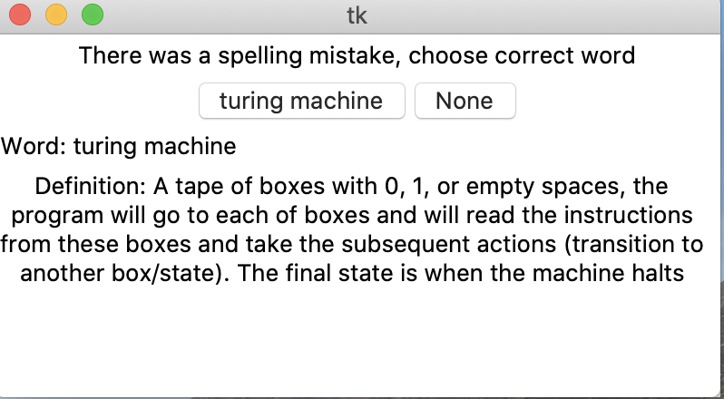

# Personal CS Dictionary 
A simple dictionary GUI that queries for definitions from user's own list of words.

### Requirements
* Python3
* TKInter
* Own dictionary file in the format *Word: Definition*

### Setup
Simply run dictionary_GUI.py and input word to be searched. If there is a spelling mistake in the word, the program will output potential guesses for the user to choose. 

**Example**

This is a sample definition in our dictionary

*Turing Machine*: A tape of boxes with 0, 1, or empty spaces, the program will go to each of boxes and will read the instructions from these boxes and take the subsequent actions (transition to another box/state). The final state is when the machine halts

If the user inputs *Turing*, the program will output *turing machine* as an option for the user to choose. The program utilizes `get_close_matches()` module from DiffLibs. 

